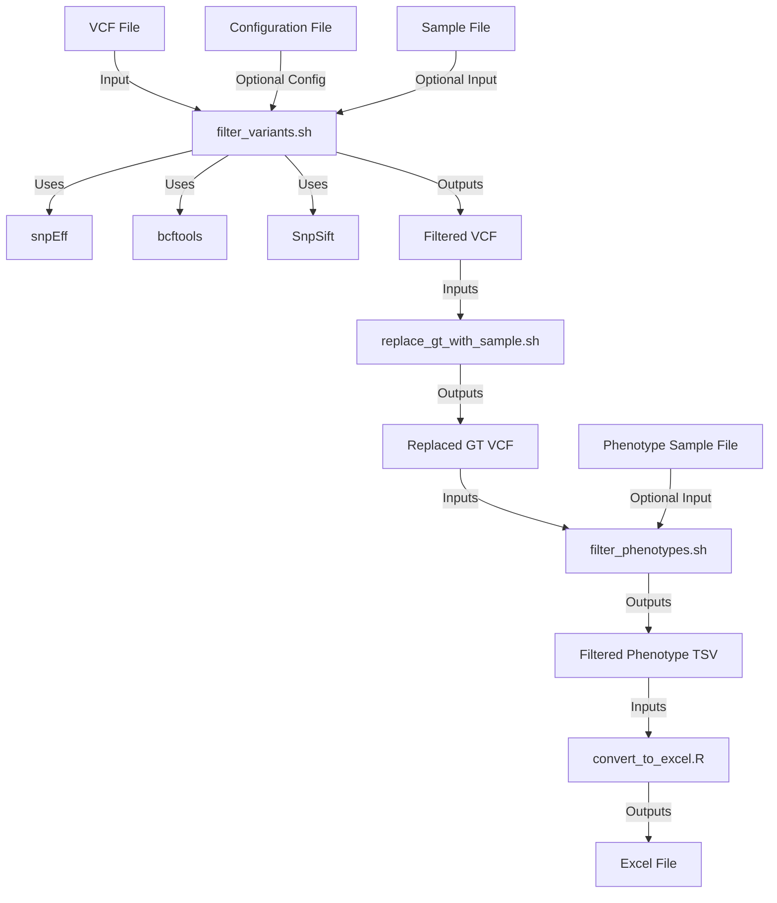

# Scripts Subfolder

This subfolder contains helper scripts that are used in conjunction with the main `filter_variants.sh` script. Each script is designed to perform specific tasks to facilitate the filtering and analysis of VCF files.

## Overview of Scripts

1. **convert_to_excel.R**
2. **filter_phenotypes.sh**
3. **replace_gt_with_sample.sh**

## Scripts Details

## filter_variants.sh

This script processes VCF files to filter and identify rare genetic variants in genes of interest using a combination of tools like snpEff, bcftools, and SnpSift. The script can also replace genotype information with samples, apply various filters, and extract specific fields from the VCF.

### Usage

```sh
./filter_variants.sh [--config config_file] <gene_name> <vcf_file_location> [reference] [add_chr] [filters] [fields_to_extract] [sample_file] [replace_script_location] [output_file]
```

### Parameters

- `--config config_file`: (Optional) The path to the configuration file containing default values for parameters.
- `gene_name`: The name of the gene of interest, e.g., "BICC1".
- `vcf_file_location`: The location of the VCF file.
- `reference`: (Optional, default: "GRCh38.mane.1.0.refseq") The reference to use.
- `add_chr`: (Optional, default: true) Whether or not to add "chr" to the chromosome name. Use "true" or "false".
- `filters`: (Optional, default: Filters for rare and moderate/high impact variants) The filters to apply.
- `fields_to_extract`: (Optional, default: Various fields including gene info, predictions, allele counts) The fields to extract.
- `sample_file`: (Optional, default: "samples.txt") The path to the file containing the sample values to use for replacement.
- `replace_script_location`: (Optional, default: "./replace_gt_with_sample.sh") The location of the `replace_gt_with_sample.sh` script.
- `replace_script_options`: (Optional) Additional options for the `replace_gt_with_sample.sh` script.
- `output_file`: (Optional, default: "variants.tsv") The name of the output file.

### Example

```sh
./filter_variants.sh -g BICC1 -v my_vcf_file.vcf -o output.tsv
```

## convert_to_excel.R

This script reads a TSV formatted file (or input from stdin) and writes it to an Excel file.

### Usage

```sh
./convert_to_excel.R --input /path/to/input_file [--output /path/to/output_file.xlsx] [--delimiter delimiter] [--sheet sheet_name] [--append]
```

### Flags

- `--help`: Display this help message
- `--version`: Display script version
- `--input`: Specify the input file or '-' for stdin
- `--output`: Specify the output Excel file (optional)
- `--delimiter`: Specify the delimiter (optional)
- `--sheet`: Specify the sheet name in the Excel file (optional, defaults to 'data')
- `--append`: Append to an existing Excel file without overwriting (optional)

### Example

```sh
./convert_to_excel.R --input input.tsv --output output.xlsx --sheet "Results"
```

## filter_phenotypes.sh

This script filters CSV/TSV files based on specified sample IDs.

### Usage

```sh
./filter_phenotypes.sh [OPTIONS]
```

### Options

- `--input-file FILE`: Path to the CSV/TSV file to be filtered.
- `--output-file FILE`: (Optional) Path to save the filtered file. If not provided, outputs to stdout.
- `--output-delimiter DELIM`: (Optional) Delimiter for the output format. Options: 'csv', 'tsv'. Default based on file extension.
- `--sample-file FILE`: (Optional) File with sample IDs, one per line.
- `--sample-list IDS`: (Optional) Comma-separated list of sample IDs.
- `--column-name NAME`: Column name containing sample IDs.
- `--help`: Display this help information and exit.
- `--version`: Display script version information and exit.

### Example

```sh
./filter_phenotypes.sh --input-file input.csv --output-file output.tsv --sample-list "329991,327338" --column-name "CGRSequenceID"
```

## replace_gt_with_sample.sh

This script processes a tab-delimited stream of data, replacing non-"0/0" genotypes in a specified field with corresponding sample IDs. If `--append-genotype` is set, genotypes are appended to the sample ID in parentheses. "0/0" genotypes are removed from the output. Optionally, it can generate a list of unique samples with non-"0/0" genotypes.

### Usage

```sh
./replace_gt_with_sample.sh [options] | your_command
```

### Options

- `--append-genotype`: (Optional) Append the genotype to the sample ID.
- `--sample-file`: (Optional) File with sample IDs, one per line.
- `--gt-field-number`: Field number for the genotype.
- `--sample-list`: (Optional) Comma-separated list of sample IDs.
- `--list-samples`: (Optional) Output a comma-separated list of unique samples with non-"0/0" genotypes.
- `--help`: Display this help message.
- `--version`: Display version information.

### Example

```sh
your_command | ./replace_gt_with_sample.sh -a --sample-file path/to/samplefile.txt --gt-field-number 14
```

## Interaction Diagram


