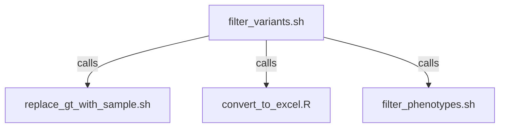

# Scripts Subfolder

This subfolder contains helper scripts that are used in conjunction with the main `filter_variants.sh` script. Each script is designed to perform specific tasks to facilitate the filtering and analysis of VCF files.

## Overview of Scripts

1. **convert_to_excel.R**
2. **filter_phenotypes.sh**
3. **replace_gt_with_sample.sh**

## Scripts Details

### convert_to_excel.R

**Description:**
This R script converts TSV formatted files to Excel files. It reads a TSV file (or input from stdin) and writes it to an Excel file. This script is useful for generating easy-to-share and readable reports from the filtered variant data.

**Usage:**
```sh
./convert_to_excel.R -i /path/to/input_file.tsv [-o /path/to/output_file.xlsx] [-d delimiter] [-s sheet_name] [-a append]
```

**Parameters:**
- `-i, --input`: Specify the input file or '-' for stdin.
- `-o, --output`: Specify the output Excel file (optional).
- `-d, --delimiter`: Specify the delimiter (optional). Options: 'csv', 'tsv', ',', '\t'.
- `-s, --sheet`: Specify the sheet name in the Excel file (optional, defaults to 'data').
- `-a, --append`: Append to an existing Excel file without overwriting (optional).

### filter_phenotypes.sh

**Description:**
This script filters CSV/TSV files based on specified sample IDs. It reads a CSV/TSV file and filters it to retain only the records that match the sample IDs provided in a sample file or list.

**Usage:**
```sh
./filter_phenotypes.sh -f input_file -o output_file -d output_delimiter -s sample_file -l sample_list -c column_name
```

**Parameters:**
- `-f, --input-file`: Path to the CSV/TSV file to be filtered.
- `-o, --output-file`: (Optional) Path to save the filtered CSV/TSV.
- `-d, --output-delimiter`: (Optional) Delimiter for the output format ('csv' or 'tsv').
- `-s, --sample-file`: (Optional) File with sample IDs, one per line.
- `-l, --sample-list`: (Optional) Comma-separated list of sample IDs.
- `-c, --column-name`: Name of the column containing sample IDs.
- `-h, --help`: Displays help information.
- `-V, --version`: Displays version information.

### replace_gt_with_sample.sh

**Description:**
This script processes a tab-delimited stream of data, replacing non-"0/0" genotypes in a specified field with corresponding sample IDs. If the `--append-genotype` option is set, genotypes are appended to the sample ID in parentheses. "0/0" genotypes are removed from the output. Optionally, it can generate a list of unique samples with non-"0/0" genotypes.

**Usage:**
```sh
./replace_gt_with_sample.sh [options] | your_command
```

**Parameters:**
- `-a, --append-genotype`: (Optional) Append the genotype to the sample ID.
- `-s, --sample-file`: (Optional) File with sample IDs, one per line.
- `-g, --gt-field-number`: Field number for the genotype.
- `-l, --sample-list`: (Optional) Comma-separated list of sample IDs.
- `-m, --list-samples`: (Optional) Only list unique samples with non-"0/0" genotypes.
- `-h, --help`: Display this help message.
- `-V, --version`: Display version information.

## Interaction Diagram


